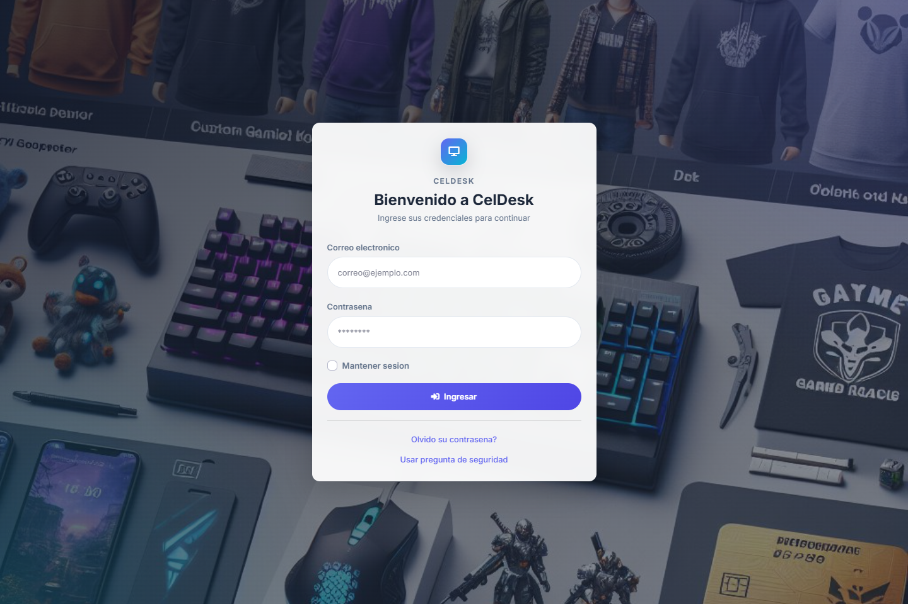
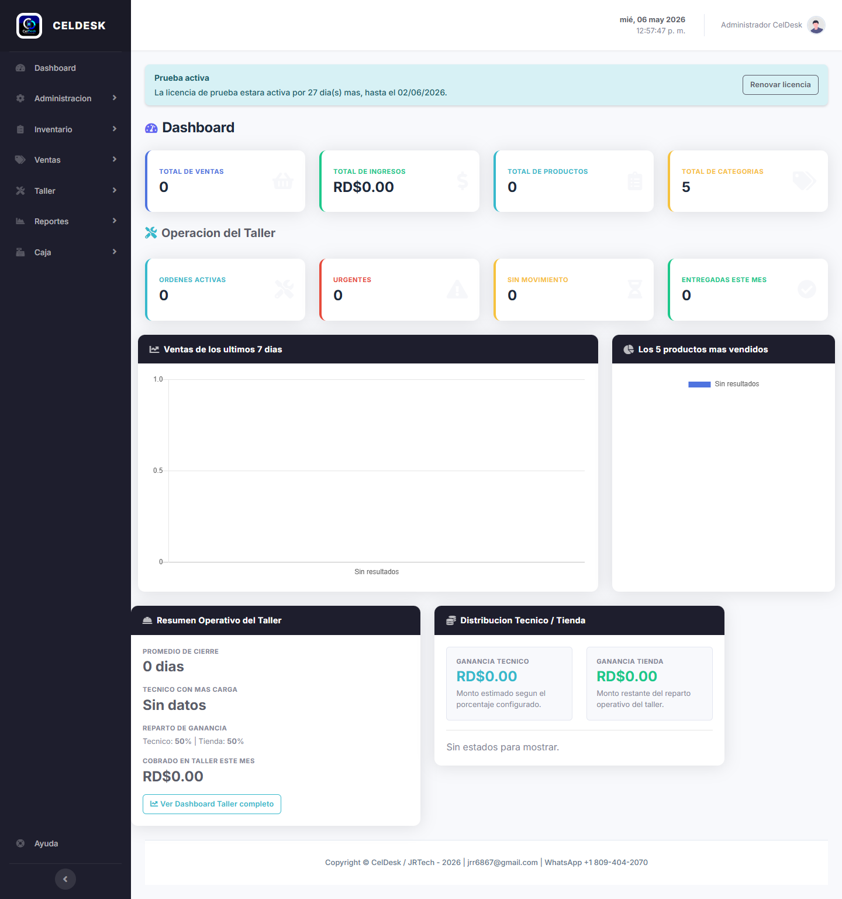
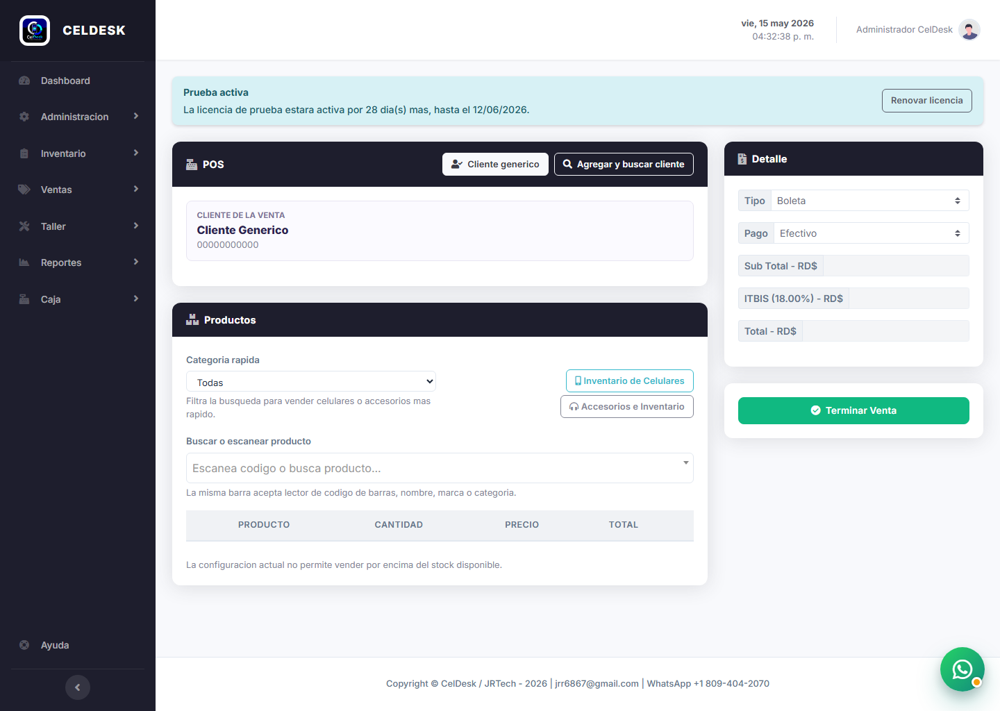
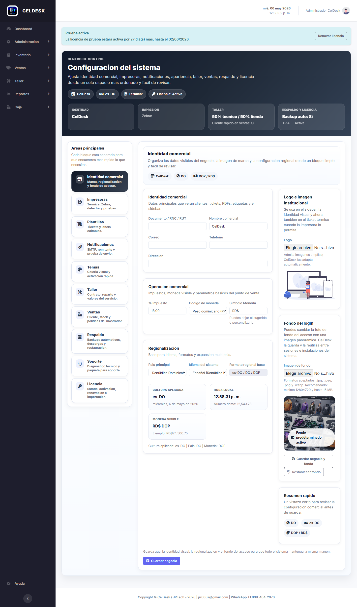
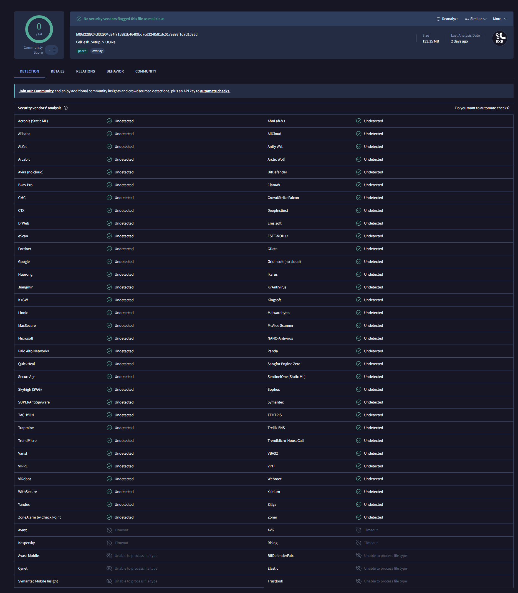

# CelDesk Setup v1.4.3

Publicacion de prueba de **CelDesk** para instalacion en Windows.

## Descargar

- [Descargar CelDesk_Public_Setup_v1.4.3.exe](https://github.com/elx19/CelDesk-Public/releases/download/v1.4.3/CelDesk_Public_Setup_v1.4.3.exe)

## Que incluye

- Instalador completo para Windows x64
- Configuracion local automatica en el primer inicio
- Base local portable incluida dentro de la instalacion
- Runtime local de WhatsApp incluido sin depender de Node.js manual
- CelDeskTray integrado
- CelDeskUpdater integrado para actualizaciones automaticas
- Soporte para parches ligeros desde versiones compatibles
- Acceso directo de escritorio
- Seleccion de idioma durante la instalacion
- Desinstalador incluido

## Requisitos

- Windows 10 o Windows 11 de 64 bits
- Permisos para instalar en el equipo

## Primer inicio

1. Ejecuta `CelDesk_Public_Setup_v1.4.3.exe`.
2. Selecciona el idioma y acepta el acuerdo de licencia.
3. Completa la instalacion.
4. CelDesk abrira el navegador automaticamente y realizara la configuracion inicial local.
5. Las siguientes versiones podran descargarse e instalarse desde CelDesk sin cierres manuales.
6. Cuando la version base sea compatible, CelDesk usara un parche ligero antes de descargar el instalador completo.

## Acceso inicial

- Correo por defecto: `admin@gmail.com`
- Contrasena por defecto: `12345`

> Recomendacion: cambia la contrasena despues del primer inicio si vas a seguir usando la instalacion.

## Notas

- Esta publicacion es solo para **descarga y pruebas**.
- El **codigo fuente** del sistema principal no se publica aqui.
- **CelDeskLicenseManager** no forma parte de esta descarga publica.

## Hash SHA-256

`675757856536D9FB601BE41BB83AE1CCF4BC46335233B25B53722DB3084DDCFD`

## Capturas

### Login

### Dashboard

### Nueva venta

### Configuracion

## Verificacion en VirusTotal

## Contacto

- Desarrollador: JRTech
- Correo: jrr6867@gmail.com
- WhatsApp: +1 809-404-2070
